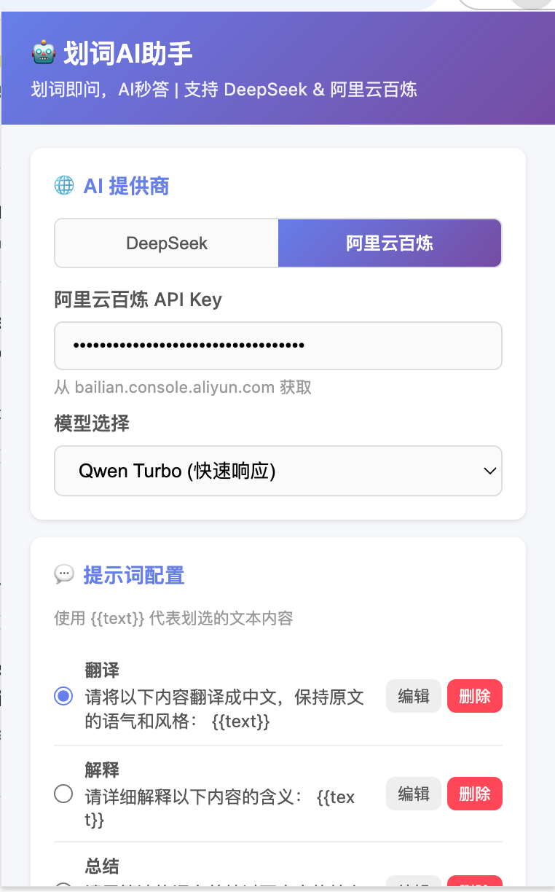
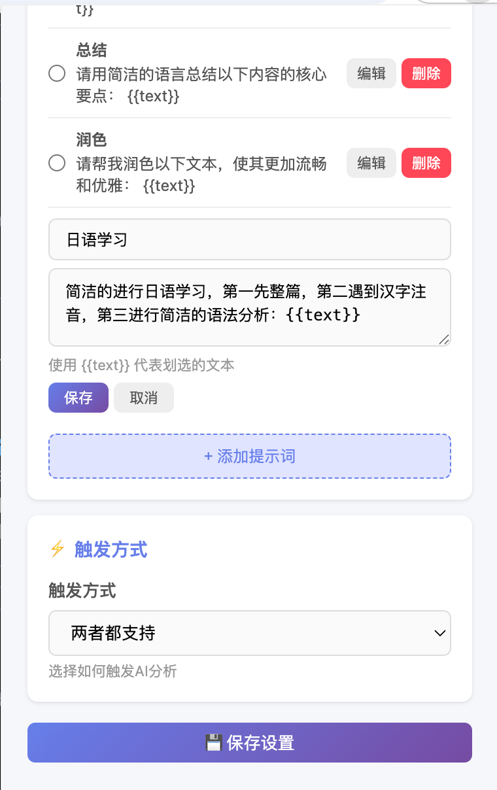
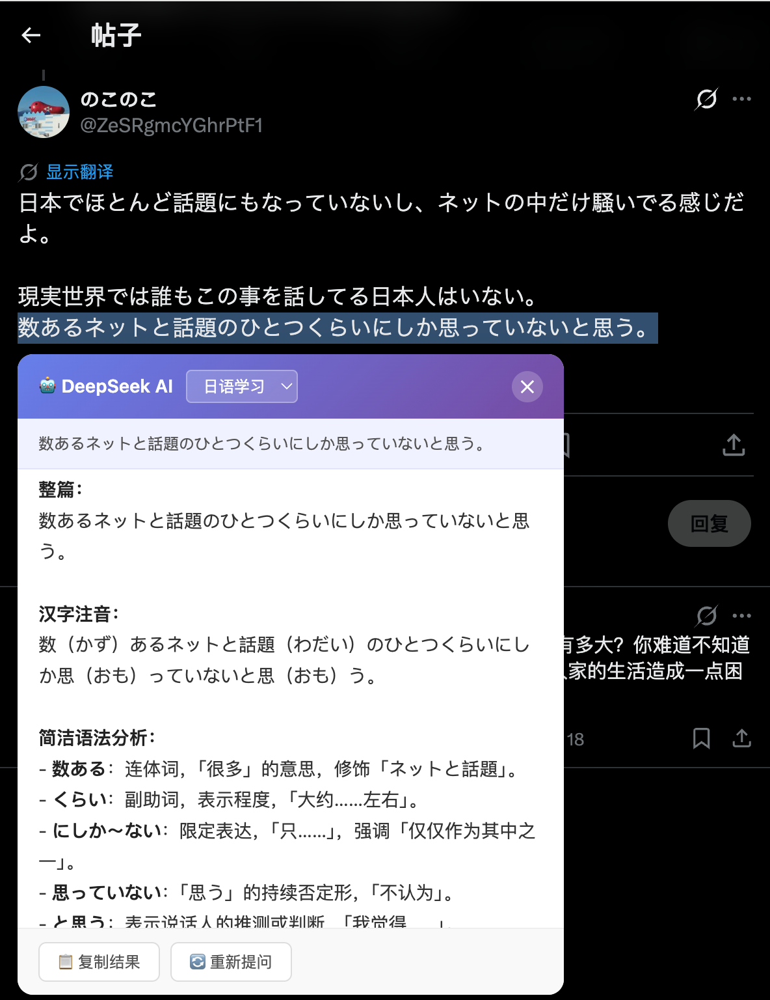

# 🤖 划词AI助手 (Selection AI Assistant)

[中文](#中文) | [English](#english) | [日本語](#日本語)

---

## 中文

### 简介

**划词AI助手** 是一个 Chrome 浏览器扩展插件，让你在网页上划词划句时，一键调用 AI 进行智能分析。支持 **DeepSeek** 和 **阿里云百炼（通义千问）** 两大AI提供商，可自定义提示词，灵活配置 API Key，划词即问，AI秒答！

### 截图展示

| 划词浮动按钮 | AI分析结果 | 设置页面 |
|:---:|:---:|:---:|
|  |  |  |

### 功能特性

- 🖱️ **划词触发** — 选中文本后自动在选区上方出现浮动按钮
- 🤖 **多AI提供商** — 支持 DeepSeek 和 阿里云百炼（通义千问），一键切换
- 💬 **可配置提示词** — 支持多个自定义提示词，使用 `{{text}}` 代表划选文本，可在结果面板中切换
- 🔑 **独立API Key** — 每个提供商独立配置 API Key 和模型
- 🧠 **丰富模型选择** — DeepSeek: Chat/Reasoner；阿里云百炼: Qwen Turbo/Plus/Max/Long
- ⚡ **多种触发方式** — 支持浮动按钮、快捷键 `Alt+S`、或两者兼有
- 📋 **结果操作** — 支持复制结果、重新提问
- 🎨 **Markdown 渲染** — 简单的 Markdown 格式渲染（代码块、粗体、标题等）
- 🌐 **全网页支持** — 可在任意网页上使用

### 支持的AI提供商

| 提供商 | 模型 | 说明 |
|--------|------|------|
| **DeepSeek** | deepseek-chat | 通用对话模型 |
| **DeepSeek** | deepseek-reasoner | 深度推理模型 |
| **阿里云百炼** | deepseek-v3 | DeepSeek V3 深度推理（通过百炼调用） |
| **阿里云百炼** | qwen-turbo | 快速响应，适合简单任务 |
| **阿里云百炼** | qwen-plus | 能力均衡，性价比高 |
| **阿里云百炼** | qwen-max | 最强能力，适合复杂任务 |
| **阿里云百炼** | qwen-long | 长文本处理 |

### 安装方法

1. 打开 Chrome 浏览器，进入 `chrome://extensions/`
2. 开启右上角的「开发者模式」
3. 点击「加载已解压的扩展程序」
4. 选择本项目的 `deepseek-selection-ai` 目录
5. 点击浏览器工具栏中的插件图标，选择AI提供商并配置 API Key
6. 在任意网页上划选文本即可使用！

### 使用方法

1. **划词分析**：在网页上选中一段文本，选区上方会出现 🤖 浮动按钮，点击即可调用 AI 分析
2. **快捷键分析**：选中文本后按 `Alt+S` 快速触发 AI 分析
3. **切换提供商**：在设置页面选择 DeepSeek 或 阿里云百炼
4. **切换提示词**：在结果面板顶部的下拉框中切换不同的提示词
5. **配置提示词**：点击插件图标打开设置页面，添加/编辑/删除提示词
6. **复制结果**：点击结果面板底部的「复制结果」按钮

### 提示词配置

在提示词中使用 `{{text}}` 作为占位符，它会被替换为你划选的文本内容。

**内置提示词示例：**

| 名称 | 提示词内容 |
|------|-----------|
| 翻译 | 请将以下内容翻译成中文，保持原文的语气和风格：\n{{text}} |
| 解释 | 请详细解释以下内容的含义：\n{{text}} |
| 总结 | 请用简洁的语言总结以下内容的核心要点：\n{{text}} |
| 润色 | 请帮我润色以下文本，使其更加流畅和优雅：\n{{text}} |

### 文件结构

```
deepseek-selection-ai/
├── manifest.json       — 插件配置 (Manifest V3)
├── background.js       — Service Worker，处理多AI提供商 API 调用
├── content.js          — 内容脚本，划词检测、浮动按钮、结果面板
├── popup.html          — 设置页面 UI（提供商选择 + 配置）
├── popup.js            — 设置页面逻辑
├── styles.css          — 浮动按钮和结果面板样式
├── imgs/               — 使用截图
│   ├── 1.png           — 划词浮动按钮截图
│   ├── 2.png           — AI分析结果截图
│   └── 3.png           — 设置页面截图
└── icons/
    ├── icon16.png      — 16px 图标
    ├── icon48.png      — 48px 图标
    └── icon128.png     — 128px 图标
```

### 获取 API Key

**DeepSeek:**
1. 访问 [DeepSeek 开放平台](https://platform.deepseek.com/)
2. 注册/登录账号
3. 在 API Keys 页面创建新的 API Key

**阿里云百炼:**
1. 访问 [阿里云百炼控制台](https://bailian.console.aliyun.com/)
2. 注册/登录阿里云账号
3. 在 API-KEY 管理页面创建新的 API Key

### 技术栈

- Chrome Extension Manifest V3
- Vanilla JavaScript（无框架依赖）
- DeepSeek Chat API (OpenAI兼容格式)
- 阿里云百炼 DashScope API (OpenAI兼容格式)
- Chrome Storage Sync API

---

## English

### Introduction

**Selection AI Assistant** is a Chrome extension that lets you instantly analyze selected text on any webpage using AI. It supports **DeepSeek** and **Alibaba Cloud Bailian (Qwen)** as AI providers, with customizable prompts and configurable API Keys — simply select text and get AI-powered insights in seconds!

### Screenshots

| Floating Button | AI Analysis Result | Settings Page |
|:---:|:---:|:---:|
|  |  |  |

### Features

- 🖱️ **Selection Trigger** — A floating button appears above the selected text automatically
- 🤖 **Multiple AI Providers** — Support DeepSeek and Alibaba Cloud Bailian (Qwen), switch with one click
- 💬 **Customizable Prompts** — Support multiple custom prompts with `{{text}}` placeholder, switchable in the result panel
- 🔑 **Independent API Keys** — Each provider has its own API Key and model configuration
- 🧠 **Rich Model Selection** — DeepSeek: Chat/Reasoner; Bailian: Qwen Turbo/Plus/Max/Long
- ⚡ **Multiple Trigger Modes** — Support floating button, keyboard shortcut `Alt+S`, or both
- 📋 **Result Operations** — Copy results, re-ask with different prompts
- 🎨 **Markdown Rendering** — Simple Markdown format rendering (code blocks, bold, headings, etc.)
- 🌐 **Universal Support** — Works on any webpage

### Supported AI Providers

| Provider | Model | Description |
|----------|-------|-------------|
| **DeepSeek** | deepseek-chat | General conversation model |
| **DeepSeek** | deepseek-reasoner | Deep reasoning model |
| **Alibaba Cloud Bailian** | deepseek-v3 | DeepSeek V3 deep reasoning (via Bailian) |
| **Alibaba Cloud Bailian** | qwen-turbo | Fast response, suitable for simple tasks |
| **Alibaba Cloud Bailian** | qwen-plus | Balanced capabilities, cost-effective |
| **Alibaba Cloud Bailian** | qwen-max | Most powerful, suitable for complex tasks |
| **Alibaba Cloud Bailian** | qwen-long | Long text processing |

### Installation

1. Open Chrome and go to `chrome://extensions/`
2. Enable "Developer mode" in the top right corner
3. Click "Load unpacked"
4. Select the `deepseek-selection-ai` directory of this project
5. Click the extension icon, select an AI provider and configure your API Key
6. Select text on any webpage and start using!

### Usage

1. **Selection Analysis**: Select text on a webpage, a 🤖 floating button will appear — click to trigger AI analysis
2. **Shortcut Analysis**: Select text and press `Alt+S` to quickly trigger AI analysis
3. **Switch Provider**: Select DeepSeek or Alibaba Cloud Bailian in the settings page
4. **Switch Prompts**: Use the dropdown in the result panel header to switch between prompts
5. **Configure Prompts**: Click the extension icon to open settings — add/edit/delete prompts
6. **Copy Results**: Click the "Copy Result" button at the bottom of the result panel

### Prompt Configuration

Use `{{text}}` as a placeholder in your prompts — it will be replaced with the selected text.

**Built-in Prompt Examples:**

| Name | Prompt |
|------|--------|
| Translate | Please translate the following content into Chinese:\n{{text}} |
| Explain | Please explain the meaning of the following content:\n{{text}} |
| Summarize | Please summarize the key points:\n{{text}} |
| Polish | Please polish the following text:\n{{text}} |

### File Structure

```
deepseek-selection-ai/
├── manifest.json       — Extension config (Manifest V3)
├── background.js       — Service Worker, handles multi-provider API calls
├── content.js          — Content script, selection detection, floating button, result panel
├── popup.html          — Settings page UI (provider selection + config)
├── popup.js            — Settings page logic
├── styles.css          — Floating button and result panel styles
├── imgs/               — Screenshots
│   ├── 1.png           — Floating button screenshot
│   ├── 2.png           — AI analysis result screenshot
│   └── 3.png           — Settings page screenshot
└── icons/
    ├── icon16.png      — 16px icon
    ├── icon48.png      — 48px icon
    └── icon128.png     — 128px icon
```

### Getting an API Key

**DeepSeek:**
1. Visit [DeepSeek Open Platform](https://platform.deepseek.com/)
2. Register/Login to your account
3. Create a new API Key on the API Keys page

**Alibaba Cloud Bailian:**
1. Visit [Alibaba Cloud Bailian Console](https://bailian.console.aliyun.com/)
2. Register/Login to your Alibaba Cloud account
3. Create a new API Key on the API-KEY management page

### Tech Stack

- Chrome Extension Manifest V3
- Vanilla JavaScript (no framework dependencies)
- DeepSeek Chat API (OpenAI-compatible format)
- Alibaba Cloud Bailian DashScope API (OpenAI-compatible format)
- Chrome Storage Sync API

---

## 日本語

### 概要

**選択テキストAIアシスタント** は、ウェブページ上でテキストを選択すると、AI を即座に呼び出して智能分析を行う Chrome拡張機能です。**DeepSeek** と **Alibaba Cloud 百炼（Qwen）** の2つのAIプロバイダーをサポートし、カスタムプロンプトとAPIキーの設定が可能で、テキストを選択すればAIが瞬時に回答！

### スクリーンショット

| フローティングボタン | AI分析結果 | 設定ページ |
|:---:|:---:|:---:|
|  |  |  |

### 特徴

- 🖱️ **選択トリガー** — テキストを選択すると、選択範囲の上にフローティングボタンが自動表示
- 🤖 **複数AIプロバイダー** — DeepSeek と Alibaba Cloud 百炼（Qwen）をサポート、一-click切替
- 💬 **カスタムプロンプト** — `{{text}}` プレースホルダーを使った複数のプロンプトをサポート
- 🔑 **独立APIキー** — 各プロバイダーに独立したAPIキーとモデル設定
- 🧠 **豊富なモデル選択** — DeepSeek: Chat/Reasoner；百炼: Qwen Turbo/Plus/Max/Long
- ⚡ **複数トリガーモード** — フローティングボタン、ショートカットキー `Alt+S`、または両方
- 📋 **結果操作** — 結果のコピー、再質問をサポート
- 🎨 **Markdownレンダリング** — コードブロック、太字、見出しなどのMarkdown形式のレンダリング
- 🌐 **全ページサポート** — 任意のウェブページで使用可能

### サポートAIプロバイダー

| プロバイダー | モデル | 説明 |
|-------------|--------|------|
| **DeepSeek** | deepseek-chat | 一般会話モデル |
| **DeepSeek** | deepseek-reasoner | 深い推論モデル |
| **Alibaba Cloud 百炼** | deepseek-v3 | DeepSeek V3 深い推論（百炼経由） |
| **Alibaba Cloud 百炼** | qwen-turbo | 高速応答、簡単なタスク向け |
| **Alibaba Cloud 百炼** | qwen-plus | 能力バランス、コスパ良 |
| **Alibaba Cloud 百炼** | qwen-max | 最強能力、複雑なタスク向け |
| **Alibaba Cloud 百炼** | qwen-long | 長テキスト処理 |

### インストール方法

1. Chromeブラウザを開き、`chrome://extensions/` にアクセス
2. 右上の「デベロッパーモード」を有効にする
3. 「パッケージ化されていない拡張機能を読み込む」をクリック
4. 本プロジェクトの `deepseek-selection-ai` ディレクトリを選択
5. 拡張機能アイコンをクリックし、AIプロバイダーを選択してAPIキーを設定
6. 任意のウェブページでテキストを選択して使用開始！

### 使用方法

1. **選択分析**: テキストを選択すると、🤖 フローティングボタンが表示 — クリックしてAI分析をトリガー
2. **ショートカット分析**: テキストを選択後 `Alt+S` を押すとAI分析を即座にトリガー
3. **プロバイダー切替**: 設定ページで DeepSeek または Alibaba Cloud 百炼を選択
4. **プロンプト切替**: 結果パネル上部のドロップダウンで異なるプロンプトに切替
5. **プロンプト設定**: 拡張機能アイコンをクリックして設定ページを開く
6. **結果コピー**: 結果パネル下部の「結果をコピー」ボタンをクリック

### プロンプト設定

プロンプト内で `{{text}}` をプレースホルダーとして使用 — 選択したテキストに置換されます。

### ファイル構成

```
deepseek-selection-ai/
├── manifest.json       — 拡張機能設定 (Manifest V3)
├── background.js       — Service Worker、複数プロバイダーAPI呼び出し処理
├── content.js          — コンテンツスクリプト、選択検出、フローティングボタン、結果パネル
├── popup.html          — 設定ページUI（プロバイダー選択 + 設定）
├── popup.js            — 設定ページロジック
├── styles.css          — フローティングボタンと結果パネルのスタイル
├── imgs/               — スクリーンショット
│   ├── 1.png           — フローティングボタンスクリーンショット
│   ├── 2.png           — AI分析結果スクリーンショット
│   └── 3.png           — 設定ページスクリーンショット
└── icons/
    ├── icon16.png      — 16pxアイコン
    ├── icon48.png      — 48pxアイコン
    └── icon128.png     — 128pxアイコン
```

### APIキーの取得

**DeepSeek:**
1. [DeepSeekオープンプラットフォーム](https://platform.deepseek.com/) にアクセス
2. アカウントを登録/ログイン
3. API Keysページで新しいAPIキーを作成

**Alibaba Cloud 百炼:**
1. [Alibaba Cloud 百炼コンソール](https://bailian.console.aliyun.com/) にアクセス
2. Alibaba Cloudアカウントを登録/ログイン
3. API-KEY管理ページで新しいAPIキーを作成

### 技術スタック

- Chrome Extension Manifest V3
- Vanilla JavaScript（フレームワーク依存なし）
- DeepSeek Chat API（OpenAI互換形式）
- Alibaba Cloud 百炼 DashScope API（OpenAI互換形式）
- Chrome Storage Sync API

---

## License

MIT License

## Contributing

Issues and Pull Requests are welcome!